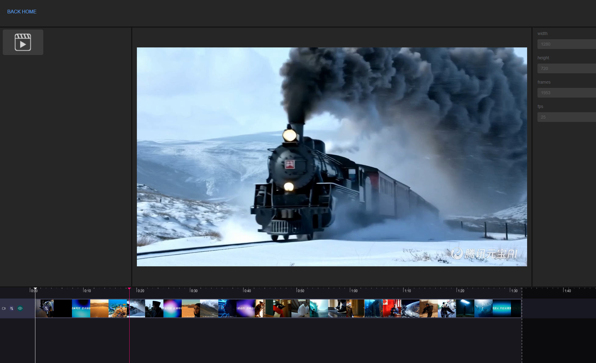
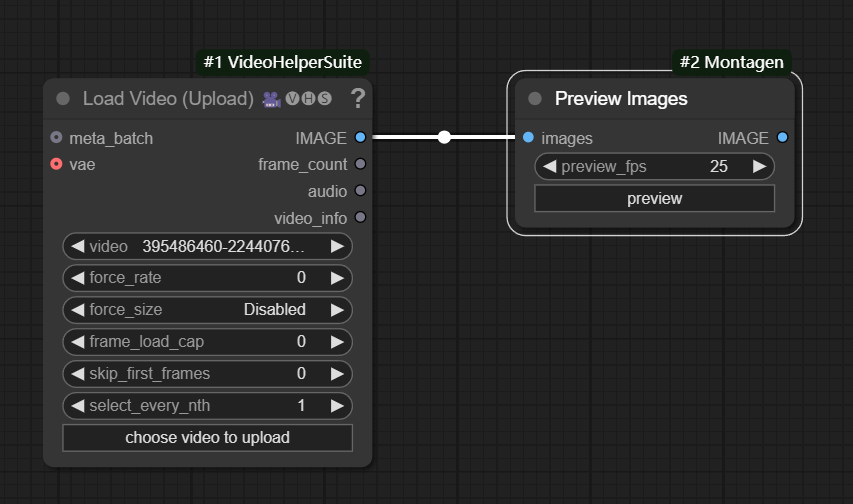

# ComfyUI-Montagen

**Montagen**, a web video editor framework, starts with the basic key features of **timeline editing** and **video preview**.  
**ComfyUI-Montagen** is an extension designed to enhance the video editing ability of [ComfyUI](https://github.com/comfyanonymous/ComfyUI) with custom nodes and Montagen. It offers basic video editing features and **integrates media clips with the ComfyUI workflow**. Furthermore, this extension unlocks the full potential of AI-based **video generation** and **task automation**.

## TODO

The project is a in very early stage, willing to hear any suggestion from the community.

- [x] Basic video editor components. Montagen timeline editor and video player.
- [ ] Basic video editing features for ComfyUI. Single clip edit and multi clips combine.
- [ ] ComfyUI-based media clip enhancement. Such as multi modal media clips support.
- [ ] Timeline template for video generation automation.

## Usage

### Preview Images

* Preview image sequence after set fps, press "preview" button to open the video player. 
* Click anywhere outside the timeline area, and press the space key to start play the image sequence.
* Use input images as output, so node output is optional.

## Installation

### Manual Install

To install ComfyUI-Montagen in addition to an existing installation of ComfyUI, you can follow the following steps:

1. goto `ComfyUI/custom_nodes` dir in terminal(cmd)
2. `git clone https://github.com/MontagenAI/ComfyUI-Montagen.git`
3. Restart ComfyUI.

### Install via ComfyUI-Manager

* Search ComfyUI-Montagen in ComfyUI-Manager and click Install button.

## Acknowledgments

Base on the project of [FFCreator](https://github.com/tnfe/FFCreator). And inspired by the examples of [miravideo](https://github.com/miravideo).