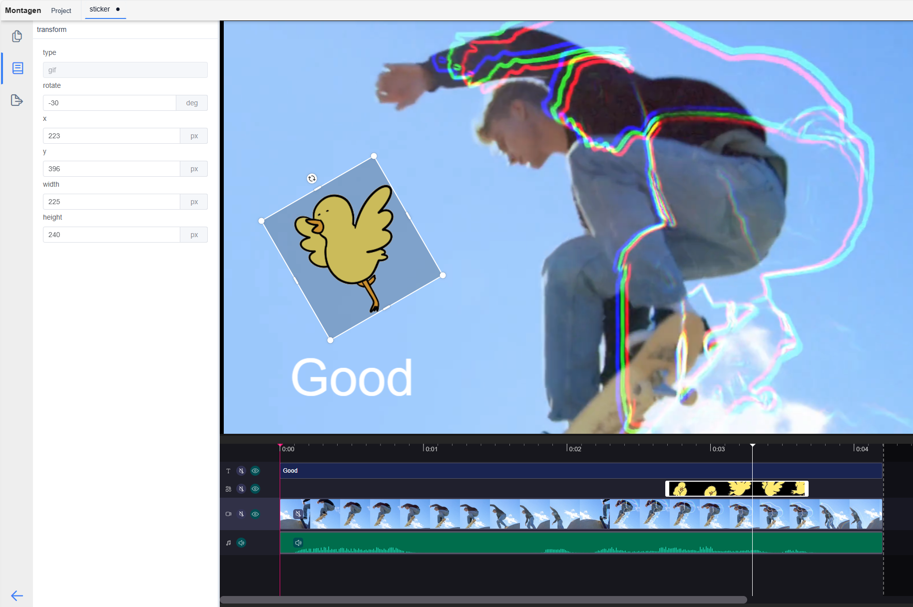
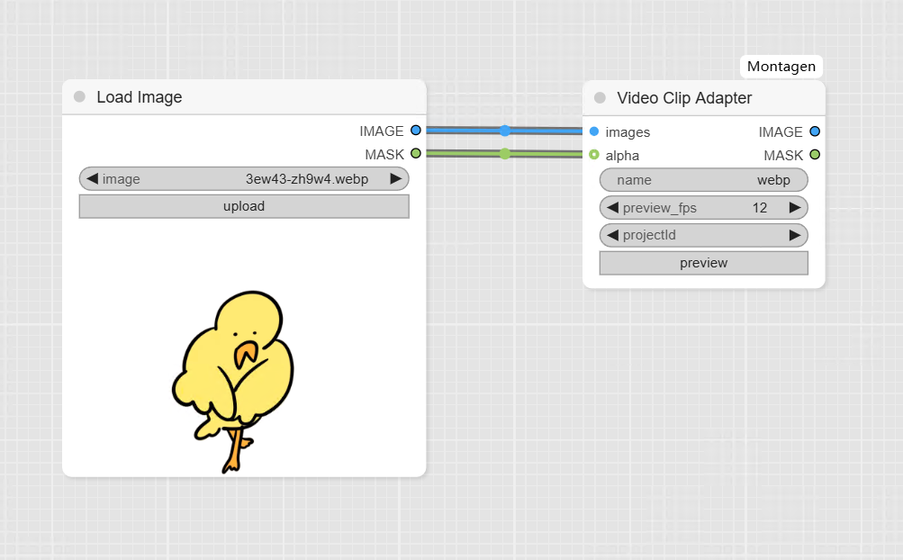

# ComfyUI-Montagen

A built-in video editor for ComfyUI, integrating media clips with custom nodes, and enabling AI-driven video generation and automation.

## [CHANGELOG](CHANGELOG.md) [0.1.1] - 2025-03-01

**Feature Update: Alpha Channel Support, Properties Panel, And Other Enhancements.**

### Added

- [UI] Easier Navigation: Click top-left `ComfyUI` or `Montagen`, to switch between the two pages.(#6)
- [UI] Add `Properties` Panel: Support basic transform controls (`rotate`, `x`, `y`, `width`, `height`) for image and video clips.(#4)
- [Editor] Add Text Clip Type: With addtional property `text` on `Properties` panel.(#7)
- [Editor] Add `STICKER` Track Type: Support `gif` image clip as a sticker.(#13)

### Changed

- [Node] Alpha Channel Support: Add alpha input and output to `Clip Adapter` nodes.(#8)
  - `Image Clip Adapter`: Add `preview_fps` parameter, working with alpha input to generate a `gif` image clip, as a special type on `STICKER` track.
  - `Video Clip Adapter`: Working with alpha input to generate a `webm` video clip, as a common video type.
- [UI] Move `Projects` To Header In `Montagen`:(#6)

## Usage

### Video Clip Adapter

* `images` is required. `alpha` is optional, only for image sequence with alpha channel.
* Set media clip `name` and `preview_fps` to use image sequence as a Montagen video clip.
* After ComfyUI workflow execution is complete, click `Preview` to open the Montagen UI.
* Use input images as output, so node output is optional.

## Installation

### Install via ComfyUI-Manager

* Search ComfyUI-Montagen in ComfyUI-Manager and click Install button.

### Manual Install

To install ComfyUI-Montagen in addition to an existing installation of ComfyUI, you can follow the following steps:

1. goto `ComfyUI/custom_nodes` dir in terminal(cmd)
2. `git clone https://github.com/MontagenAI/ComfyUI-Montagen.git`
3. Restart ComfyUI.

## Acknowledgments

Base on the project of [FFCreator](https://github.com/tnfe/FFCreator). And inspired by the examples of [miravideo](https://github.com/miravideo).
