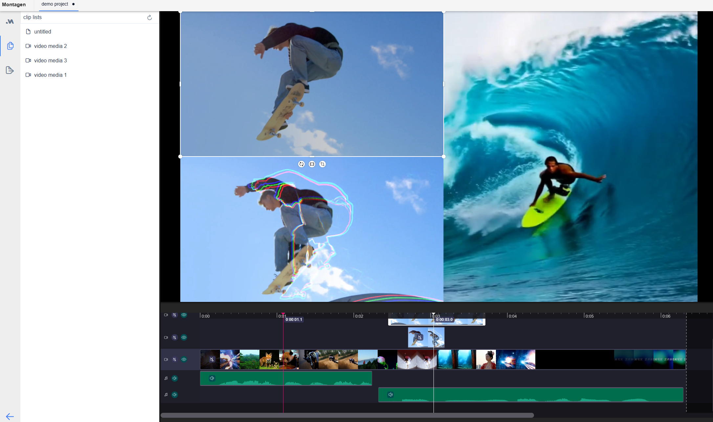
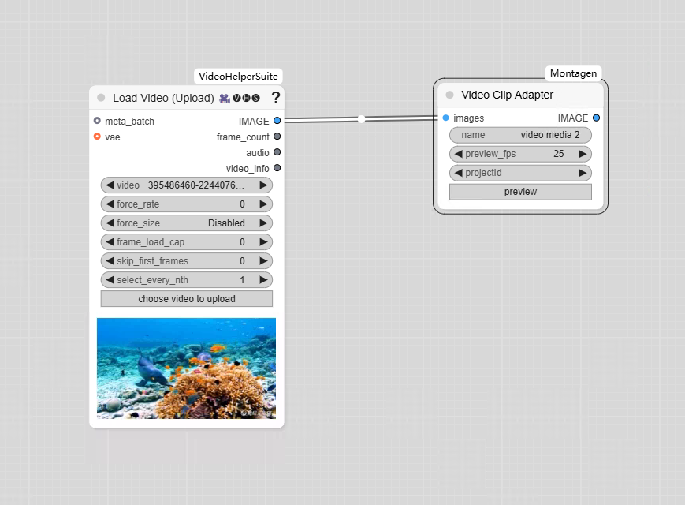

# ComfyUI-Montagen

**Montagen** is a web video editor with timeline editing and preview.  
**ComfyUI-Montagen** extends [ComfyUI](https://github.com/comfyanonymous/ComfyUI) with custom nodes, enabling media clip integration alongside AI-driven video generation and automation.

## [CHANGELOG](CHANGELOG.md) [0.1.0] - 2025-02-22

### Added

**Initial Release: Core Video Editing Features for ComfyUI.**

- [Core] The Structural Mapping Between ComfyUI and Montagen:
  - ComfyUI Workflows & Montagen Project: Combine multiple ComfyUI workflows into a structured timeline project for seamless video editing. Each workflow can be linked to only one Montagen project and cannot be shared across projects.
  - ComfyUI Node & Montagen Clip: Within a ComfyUI workflow, a node's media output is linked to a `Clip Adapter` node, making it a media clip in a Montagen timeline project. A workflow can generate multiple independent clips, each editable separately.
- [Node] Clip Adapter:    
  Input: `[images | images | audio]`.   
  Output: `<optional>` original input.   
  Parameters: `name` (Clip identifier), `projectId` (No need to change).   
  After ComfyUI workflow execution is complete, press `Preview` to open the Montagen UI. Types of `Clip Adapter` nodes:
  - `Image Clip Adapter`: Montagen image clip.
  - `Video Clip Adapter`: Set `preview_fps` to use image sequence as a Montagen video clip.
  - `Audio Clip Adapter`: Montagen audio clip.
- [UI] Montagen UI: Unified Montagen UI (`Navigation System`, `Project Tabs`, `Editor`, `Player`) based on the ComfyUI layout.
  - Project Tabs: Each project opens in a dedicated tab, with each tab containing both an `Editor` and a `Player`.
- [UI] Navigation System: The system includes all functional components, with new features being added to the navigation bar.
  - `Projects`: Manage multiple projects, including `Create`, `Open`, `Delete`.
  - `Clips`: Clips list of the project.
  - `Export`: Export the project as a video file.
- [Editor] Core Video Editing Components:
  - Timeline Container: Basic component (`Time Ruler`, `Playhead`, `Hover Indicator`, `Zoom in/Out`). Supports multiple tracks to organize different clip types.
  - Track Management: Track type (`Text`, `Audio`, `Video & Image`) for specific clips. With control of `Mute`, `Hide/Show` for specific type of tracks.
  - Clip Creation: Start by using dedicated `Create` actions (`Create Image`, `Create Video`, `Create Audio`) to generate an empty clip. 
  - Clip Editing: Seamlessly integrate clip with corresponding ComfyUI workflow for further editing through `Edit Workflow`.
  - Basic Clip Manipulation: Supports `Select`, `Hide/Show`, `Delete` for single clip edit. And `Drag & Drop`, `Snap` clip within and across tracks.
- [Player] Core Video Editing Components:
  - Transform Controls: `Position`, `Scale`, `Rotation`. Directly manipulate video clips in the Player viewport with real-time preview. 

### Changed

- [Editor] Frame Locate & Preview: Requires clicking the clip (instead of hovering) to preview and locate a frame.
  
### Removed

- [Node] `Preview Images`: Deprecated, replaced by `Video Clip Adapter`.
- [UI] Media Panel & Metadata Panel: Placeholder panels removed for cleaner UI. Replaced by Navigation System.

## Usage

### Video Clip Adapter

* Set media clip `name` and `preview_fps` to use image sequence as a Montagen video clip.
* After ComfyUI workflow execution is complete, press `Preview` to open the Montagen UI.
* Use input images as output, so node output is optional.

## Installation

### Install via ComfyUI-Manager

* Search ComfyUI-Montagen in ComfyUI-Manager and click Install button.

### Manual Install

To install ComfyUI-Montagen in addition to an existing installation of ComfyUI, you can follow the following steps:

1. goto `ComfyUI/custom_nodes` dir in terminal(cmd)
2. `git clone https://github.com/MontagenAI/ComfyUI-Montagen.git`
3. Restart ComfyUI.

## Acknowledgments

Base on the project of [FFCreator](https://github.com/tnfe/FFCreator). And inspired by the examples of [miravideo](https://github.com/miravideo).
