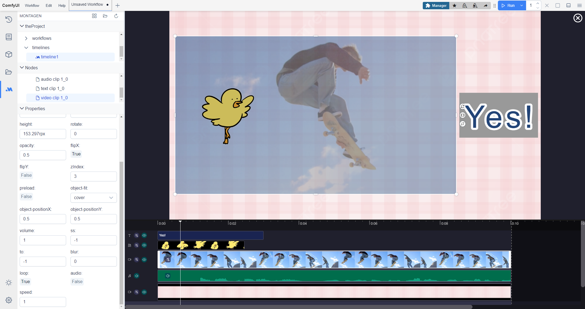
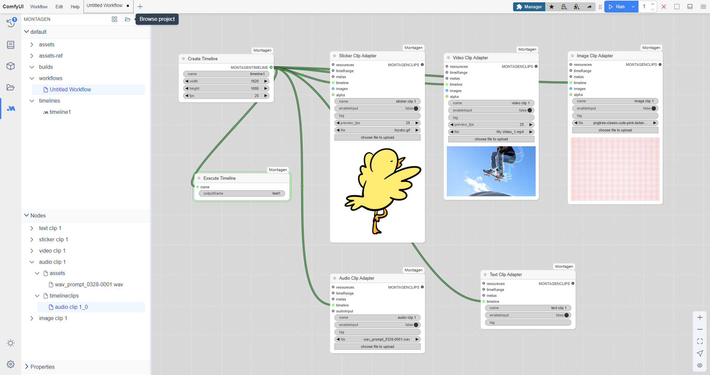

# ComfyUI-Montagen

*ComfyUI Video Studio with Node-Controlled Timelines for Multi-Task Production.*

## Key Features

### 🎞️  Node-Controlled Timeline Architecture

- Parameterized Timeline Setup
  - Set resolution/FPS via `Create Timeline` nodes
  - Initiate batch rendering with `Execute Timeline` nodes 
  - Deep integration between node workflows and video timelines
- Bi-Directional Metadata Sync
  - Real-time synchronization between node parameters and timeline properties
  - Reverse-tweak generated content via editor-side adjustments

### 🖥️ Integrated Production Workspace

- Unified Preview
  - Timeline visualization embedded in ComfyUI interface 
  - Asset preview through `Editor` and `Player` component
- Structured Project System
  - Standard directory templates (`assets/`/`workflows/`/`timelines/`)
  - Hybrid protocol support (Local/HTTP/SMB/FTP) for unified resource management

### 🚀 Batch Production Pipeline

- Multi-Timeline Rendering
  - Each timeline produces one video
  - Centralized output management via `builds/` directory
- Prebuilt Scenarios (In Development)
  - Digital human video synthesis
  - Batch processing templates
  - Novel-to-video automation

## Usage

### Step 1, Open Project

1. Select `Montagen` icon from ComfyUI Activity Bar, to display Montagen Explorer.
2. Start from `default` project, or click `Browse project` to enter custom project folder path.
3. Click `Open project` to open recent project.

### Step 2, Create Timeline

1. Add `Create Timeline` node and set up timeline paramters.
2. Add `Clip Adapter` nodes, set up paramters, and connect to the `Create Timeline` node.
3. Run workflow to create timeline.

### Step 3, Timeline Editing

1. Select timeline from project Explorer panel, to display timeline `Editor` and `Player`.
2. Select specify clip and open `Nodes` and `Properties` Explorer panel, to display the clip's metadata.
3. Edit with timeline or `Properties` panel, to update the timeline.

### Step 4, Timeline Rendering

1. Add `Execute Timeline` node and set up file name, and connect to the `Create Timeline` node.
2. Run workflow to rendering timeline.
3. Select `builds/` from project Explorer panel, and preview output files.

## [CHANGELOG](CHANGELOG.md) [0.2.0] - 2025-04-03

*Architected Release: Project-Structured Video Production Framework with Node-Controlled Timelines for ComfyUI.*

### Added

- [Core] Project System:
  - Standalone Project Directory: Create/import projects with dedicated subdirectories.
  - Consolidated Resource Management: Unified storage for workflows, timelines, and assets.
  - Task-oriented Pipeline: Sequential video editing task processing within project scope.
  - `assets/`: Local asset storage.
  - `assets-ref/`: Virtual file system for remote assets (Supports: HTTP/SMB/FTP/Local).
  - `builds/`: Timeline rendering outputs.
  - `workflows/`: Montagen-enhanced ComfyUI workflows.
  - `timelines/`: Video output configurations (1 timeline = 1 video).
  - `tmp/`: System cache (UI hidden).
  - `project.montagen`: Project manifest (UI hidden).
- [Core] Explorer System:
  - Project Selection: Open recent/custom projects, browse project directories, and refresh project structure.
  - Unified Activity Bar: Integrated control panels with contextual binding.
  - `project` Panel: Visualizes directory hierarchy.
  - `nodes` Panel: Displays workflow/timeline items.
  - `properties` Panel: Metadata inspector with two-way data binding.
- [UI] Unified Preview:
  - Unified Asset Preview: Asset preview through `Editor` and `Player` component.
  - Inline Timeline Preview: Timeline visualization embedded in ComfyUI interface.
- [Node] Montagen Timeline Nodes:
  - `Create Timeline`: Initialize with `name`, `width`, `height`, `fps` parameters.
  - `Execute Timeline`: Render timeline to file with custom output name (e.g. "final.mp4").

### Changed

- [Core] Project System:
  - Exclusive Project Focus: Only one project can be actively edited at any time.
  - Multi Workflows: Node-based blueprinting, each workflow defines specific editing processes.
  - Multi Timelines: Each timeline produces one video. Multiple timelines allow sequential generation of multiple videos.
- [UI] `project` Panel: 
  - `assets\`: Upload assets to the project directory.
  - `assets-ref\`: Add remote assets as a native file (Supports: local path, HTTP, SMB, FTP).
- [UI] `nodes` Panel:
  - Workflow Items: Display Montagen nodes of the selected workflow.
  - Timeline Items: Display Montagen clips of the selected timeline.
- [UI] `properties` Panel:
  - Asset Metadata: Technical specifications and origin data.
  - Clip Properties: Timeline parameters with two-way binding to `Editor` and `Player`.
- [Node] Adapter Node Paramters Overview:
  - `resources`: Optional input. (In Development) 
  - `timeRange`: Optional input. (In Development) 
  - `metas`: Optional input. (In Development)
  - `MONTAGENCLIPS`: Optional output. (In Development)
  - `name`: Required, clip id.
  - `enableInput`: Default fasle. Set true when optional input is used.
  - `tag`: Optional input. (In Development)
  - `file`: [`file` | `mediaInput`]. Choose file to upload instead of media input.
  - `mediaInput`: [`file` | `mediaInput`]. Use media input instead of choose file to upload.
- [Node] Adapter Node Type:
  - `Image Clip Adapter`: Default clip duration is 3s.
  - `Video Clip Adapter`: With `preview_fps`.
  - `Sticker Clip Adapter`: With `preview_fps` like `Video Clip Adapter`, display in specify timeline track.
  - `Audio Clip Adapter`: No specify paramters.
  - `Text Clip Adapter`: With no `mediaInput`, the clip content can be updated through `Properties` panel.

### Removed

- [UI] `Montagen` Page:
  - Deprecated Components: Legacy Navigation System, and sandalone Tab for `Editor` and `player`.
  - Feature Migration: Full integration into ComfyUI interface. And Explorer System replaces legacy Navigation System.

## Installation

### Install via ComfyUI-Manager

* Search ComfyUI-Montagen in ComfyUI-Manager and click Install button.

### Manual Install

To install ComfyUI-Montagen in addition to an existing installation of ComfyUI, you can follow the following steps:

1. Goto `ComfyUI/custom_nodes` dir in terminal (cmd)
2. `git clone https://github.com/MontagenAI/ComfyUI-Montagen.git`
3. Restart ComfyUI.

## Acknowledgments

- Base on the project of [FFCreator](https://github.com/tnfe/FFCreator). And inspired by the examples of [miravideo](https://github.com/miravideo).
- Reference portions of media loading/preview code from [ComfyUI-VideoHelperSuite](https://github.com/Kosinkadink/ComfyUI-VideoHelperSuite) into our custom node implementation.