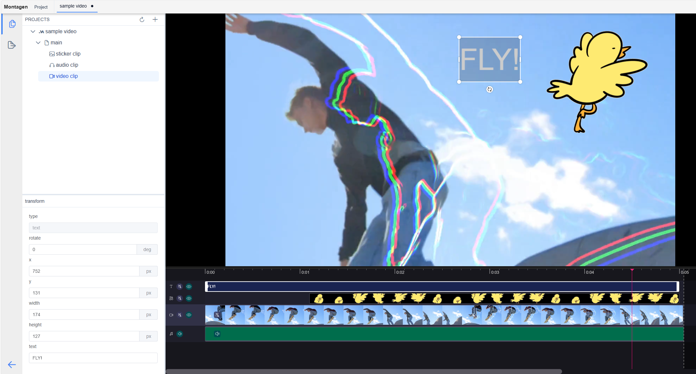
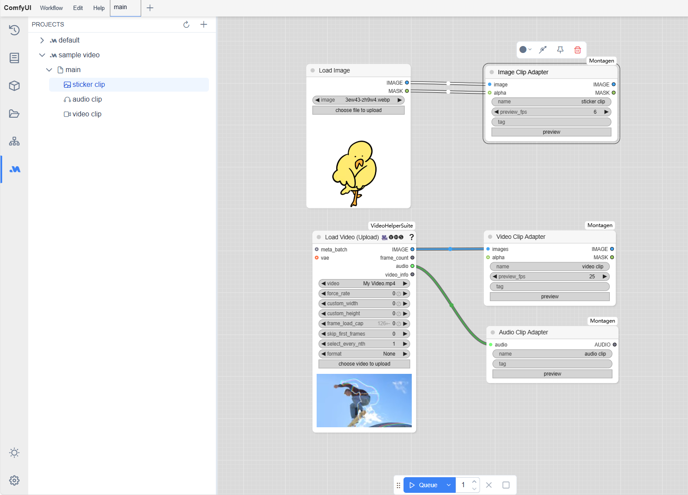

# ComfyUI-Montagen

A built-in video editor for ComfyUI, integrating media clips with custom nodes, and enabling AI-driven video generation and automation.

## [CHANGELOG](CHANGELOG.md) [0.1.2] - 2025-03-08

**Feature Update: Better Project Manipulation With New Directory Hierarchy.**

### Changed

- [UI] Enhanced Project Panel in `ComfyUI`: (#14)
  - Display the project hierarchy, including the workflows and clips within each project.
  - Left Click to `Select` item.
  - Right click to open a menu with options: `Open`, `Add`, `Rename`, `Delete`.
- [UI] `ComfyUI` Tab Sync: Synchronize the `Select` state of items between the Project Panel and ComfyUI Tabs.(#16)
  - A `Workflow` from `Projects` Panel, is linked to the `Workflow` tab in `ComfyUI`.
  - A `Clip` from `Projects` Panel, is linked to the `Clip Adapter` node in the `Workflow` page.
- [UI] Workflow As Directory: `Add` or `Edit` clips in the specified original workflow instead of opening a new workflow.(#18)
- [UI] Explorer Panel In `Montagen`: Combine `Project` and `Property` together in one panel.(#9)

### Fixed

- [UI] Keyboard Letter Conflict: When input 'a', 's' key, it's not working.(#5)

## Usage

### Integrating Media Clips With `Clip Adapter` Nodes

#### Steps

1. Add a project with `width` and `height` from Montagen `PROJECTS` panel.
2. Add a workflow in the project, and add `Clip Adapter` nodes.
3. Execute the workflow.
4. `Open` and `Edit` clips in `Montagen`.

#### `Clip Adapter` Nodes

* `Video Clip Adapter` & `Image Clip Adapter`
  * `images` is required. `alpha` is optional, only for image sequence with alpha channel.
  * Set `preview_fps` to use image sequence as a Montagen clip.
* `Audio Clip Adapter`
  * `audio` is required.
 * Use input images as output, so node output is optional.
 * Set media clip `name` to inditify the clip from `PROJECTS` panel.

## Installation

### Install via ComfyUI-Manager

* Search ComfyUI-Montagen in ComfyUI-Manager and click Install button.

### Manual Install

To install ComfyUI-Montagen in addition to an existing installation of ComfyUI, you can follow the following steps:

1. goto `ComfyUI/custom_nodes` dir in terminal(cmd)
2. `git clone https://github.com/MontagenAI/ComfyUI-Montagen.git`
3. Restart ComfyUI.

## Acknowledgments

Base on the project of [FFCreator](https://github.com/tnfe/FFCreator). And inspired by the examples of [miravideo](https://github.com/miravideo).
